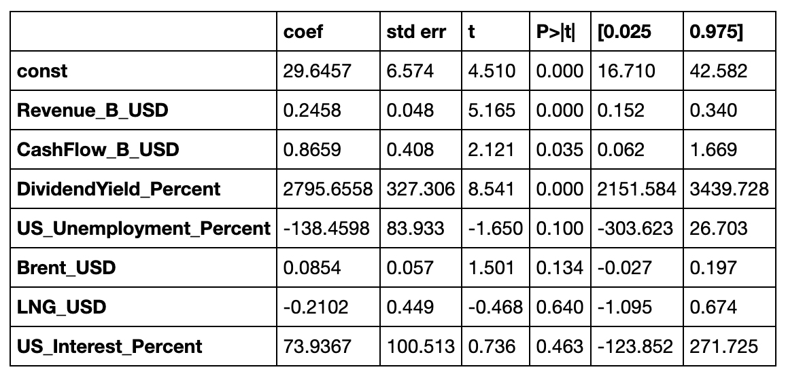
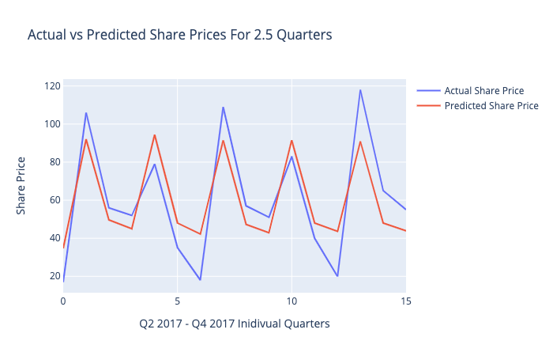
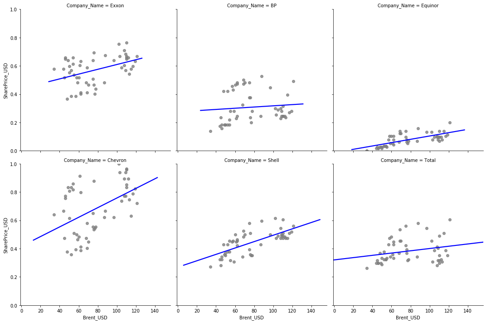
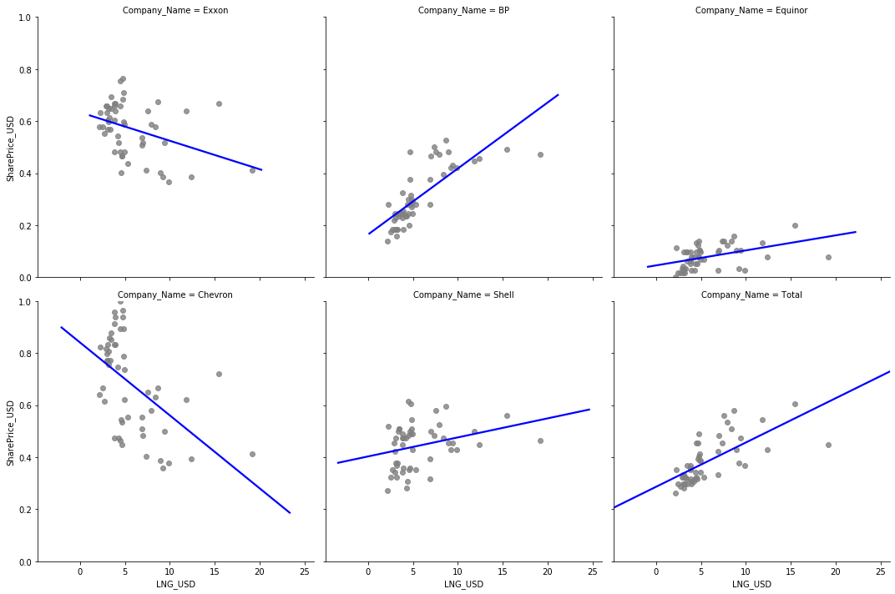

# Machine Learning Meets Energy Share Prices

## Project Question:
### Do external and internal factors have an impact on the share price of Energy companies? If so, which factors are more important?

## Objective:
### Using an API for fetching share data and give information about current situation of each share
### Use statistical models & Machine Learning libraries to test the relationship between internal/external variables and Energy Company share prices.

## Project Summary:
A million-dollar question is what factors can be used to predict future share prices? Our humble attempt was to brainstorm what internal & external factors would most likely impact share prices of large Energy companies. Our belief was that one of the top factors would be the price of oil. Four factors for each were selected:

**Internal:** Revenue, Expenses, Divident Yield, & Cash Flow

**External:** US Interest Rate, US Unemployment Rate, Brent Oil Price, & LNG Price

We gathered quarterly data from the years 2005-2017 using Yahoo Finance, FRED, & Macrotrends websites. Data was gathered for 6 selected large energy companues: **Exxon ( XOM ), BP, Equinor ( EQNR ), Chevron ( CVX ), Shell ( RDS-A ), & Total ( TOT ).** This created a dataset of 312 records. SQL was used for data transformation & cleaning.

We started by running a coefficient matrix to check that all variables were independent of each other. It was found that Expenses & Revenue were highly related, therefore we decided to drop Expenses to reduce bias in the dataset. Then we ran a statistical summary to check the significance. **Revenue, Dividend Yield, Cash Flow, & Unemployment Rate were all significant and the remaining variables were insignificant.** 

After having a general idea of the data, we moved to the next step of building ML models. The sklearn library was used to build the model. We began with a **linear regression model** because it seemed best suited for the data as proven by the residual plot that showed data points scattered around the horizonal line. The **R2 score was .364** which meant there was a weak or low relationship between the dependent & independent variables.

Other linear models used were **Lasso, Ridge, & ElasticNet** that reduce variation in the data by increasing bias and penalizing the coefficients that are farther from zero. Still, all of these models showed a weak relationship between indepent and dependent variables. **All had MSE above .8 and R2 score below .30, which means there is a very weak relationship.**

We then tried to use non-linear models on the data. These included **Decision Tree & Random Forest** and checked the importance of columns in the random forest. **Decision tree only showed 10% accuracy and random forest showed 7.7% accuracy.** An interesting finding was that on the decision tree importance ranking Brent Oil Price & LNG Pricee were found as more significant and US Unemployment was founds as less significant. 

<pre><code>Decision Tree Feature Importance Output:
[(0.20605433490259506, 'Revenue_B_USD'),
 (0.18525105444926565, 'CashFlow_B_USD'),
 (0.15940987904502657, 'DividendYield_Percent'),
 (0.11934434374586309, 'Brent_USD'),
 (0.11579472494985532, 'LNG_USD'),
 (0.10891831024240926, 'US_Interest_Percent'),
 (0.10522735266498491, 'US_Unemployment_Percent'),
 (0.0, 'SharePrice_USD')]</code></pre>
 
The next step was to use Auto Arima to forecast and visualize the last few quarters of data half of 2017 Q2 data, all 2017 Q3 data, & all 2017 Q4 data. **The objective was to check the actual share price in comparison to the predicted share price.** After the prediction I exported the data points and replotted them using plotly for a better visual comparison. The predicted vs actual share prices were similar enough to be believable, but not close enough to be considered accurate. 

After the forecast, we took a closer look at the relationship between Brent Oil Price & LNG Price vs Share Price. In the plots shown, **Brent Oil Price does not appear to have a strong relationship with most company Share Prices, LNG Price appears to have a slightly stronger relationship** with Share Price than Brent had.
## Brent Oil Price vs. Share Price

## LNG Price vs. Share Price

### Conclusions
* Scores are low for all model types
* Chosen independent variables do not have a significant affect on the Share Price of Oil & Gas companies
* Even with low score, price predicitions were still in a belivable range
* Data collection & ensuring data is clean is often the most tedious part of Machine Learning
* Importance of understanding what each model is doing to properly interpret the output

### Assumptions 
* Data is normalized 
* Variable are independent in order to prevent bias
* Independent variables have a relationship with dependent variable

### If We Had More Time
* Research what are the top factors affecting Energy share prices
* Research if Carbon Emissions reporting has an affect on share prices
* Create new data set that reflects the lag effect that Oil Prices may have on share prices (i.e. oil prices in Q2 would affect share price in Q3)

#### Tools Used:
* numpy
* **pandas**
* seaborn 
* **matplotlib**
* statsmodels
* **sklearn**
* pmdarima
* **plotly**
* holoviews
* **SQL**

*Bold denotes a required tool*
